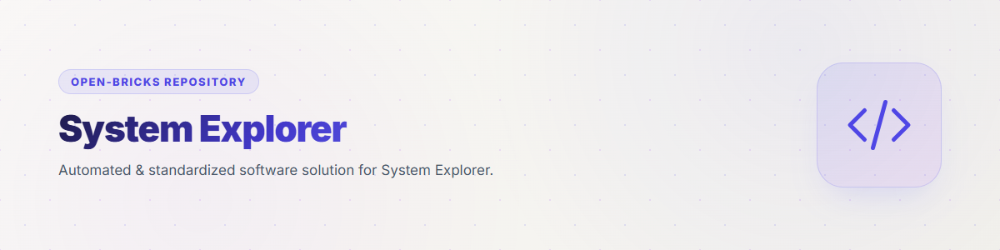

# system-explorer



[](tests)
[](pyproject.toml)
[](LICENSE)
[](https://github.com/ellmos-ai)
[](https://github.com/open-bricks)

[English](README.md) | [Deutsch](README_de.md)

> [!NOTE]
> Für einen LLM-optimierten Index und Referenzübersicht siehe [`llms.txt`](file:///C:/_Local_DEV/repos/system-explorer/llms.txt).

`system-explorer` erstellt evidenzgestützte Karten eines modularen Agenten- und
Softwaresystems. Das Werkzeug trennt dabei zwei Ebenen:

1. **Sollfunktionen** – was das Gesamtsystem leisten soll.
2. **Funktionsträger** – Skills, Repositories/Module, MCP-Schnittstellen,
   Stacks, Akteure, Befehle oder andere Komponenten, die diese Funktionen
   tatsächlich oder geplant tragen.

Aus dieser Zuordnung erkennt es Voll-, Unter-, Nicht-, Mehrfach- und
Minusdeckung. Eine Funktion ohne belegten Träger ist nicht einfach
„unbekannt“, sondern eine sichtbare Systemlücke.

## Eigenschaften

- begrenzter Scanner für Manifeste, Skills, Einstiegspunkte und Dokumentlinks
- typisierte Steuerkarten für `AGENTS.md`, `CLAUDE.md`, `README.md`, Policies,
  Decisions, frei konfigurierte Steuerdateien und Eintrittsverzeichnisse
- Registry-, Datenbank- und Cloudkarten mit Tabellen, Ist-/Soll-Datenakteuren,
  Transferwegen und reinen Credential-Referenzen
- lokales SQLite-Evidenzregister mit URI, Locator, Hash und Zeitbezug statt
  kopierter Quelldaten
- Sollspezifikation für Funktionen, Träger, Deckung und Struktur
- Transcript-Adapter für Codex, Claude Code, Claude Desktop, Gemini/agy, Kimi
  und generisches JSONL
- Actual-, Desired-, Diff- und Coverage-Karten als JSON, ASCII, Mermaid und HTML
- föderierte Kartenimporte/-exporte mit identischen Ansichten je Gerät,
  Systemgrenzen sowie Gesamtebenenanalyse
- Privat-/Teiloffen-Servercheck, Schutzdeckung, Kosten-/Lokalvergleich und
  Zweckprüfung einzelner Module oder Repositories
- LLM-Spuren- und LLM-Handlungskarten für Sessions, CLI-, API-, Tool- und
  Systemverbindungswege
- Funktionspfadkarten von Entrypoints und Akteuren über Träger zu Funktionen,
  Outputs und systemübergreifenden Übergaben
- kristallisierte Randressourcen für installierte Software, Fremdmodule,
  Repositories, Skripte und Skills mit LLM-Steuerweg, Flexibilität und
  belegpflichtigem Tokenersparnispotenzial
- additive V4-Kompositionsverträge für Bundles, Kataloge, Systeme,
  gewünschte Instanzen, Resolutionstests und Flotten
- deterministische, gepinnte Read-only-Auflösung mit Profilen,
  Suppressions, Root-Containment und kanonischen Content-Hashes
- typisierte Read-only-Brücke von `system-explorer.resolution.v1` in
  Desired-/Coverage-Evidenz mit Requirement-Schwere und Provider-Overlap
- explizite, gehashte Function-Equivalence-Verträge zwischen abweichenden
  Desired- und Actual-Funktions-IDs; ohne Namens- oder Ergebnisheuristik
- optionale ApiProber-Evidenzaufnahme für autorisierte passive REST-Prüfungen
- `ai-media-editor`-Connector für erklärvideo-taugliche Storyboards,
  Sprechertexte und Mermaid-Schaltpläne aus analysierten Systemkarten
- sichere, idempotente Repo-/Bundle-Schaltplanpflege mit Dry-Run,
  Lock-/Dirty-Gates, atomarem Readback sowie optionalem Commit und Push
- lokale grafische Oberfläche mit belegbezogenen Details
- schreibgeschützte, promptgestützte Änderungsentwürfe mit Pflichtgates
- Trampelpfad-Probepläne für externe, budgetierte Schwarmtests

## Schnellstart

```powershell
python -m venv .venv
.\.venv\Scripts\python -m pip install -e .
system-explorer init --config explorer.json
system-explorer ingest --config explorer.json --time-budget-seconds 300
system-explorer coverage --config explorer.json
system-explorer assess --config explorer.json
system-explorer map --config explorer.json --view control --format mermaid
system-explorer map --config data-cloud.json --view data --format html --output data-map.html
system-explorer documents --config explorer.json --role policy
system-explorer register X:\system\SPECIAL-ENTRY.md --role control --entry --config explorer.json
system-explorer map --config explorer.json --view coverage --format html --output map.html
system-explorer map-export --config explorer.json --view all --output system-map-WORKSTATION.json
system-explorer map-import system-map-LAPTOP.json --config explorer.json
system-explorer map --config explorer.json --view llm-traces --system LAPTOP
system-explorer map --config explorer.json --view federation
system-explorer server-check --config deployment.json
system-explorer provider-refresh --config deployment.json
system-explorer purpose-check --target carrier:system-explorer --config deployment.json
system-explorer resources --config software-resources.json
system-explorer map --config software-resources.json --view resources
system-explorer explain-video --config explorer.json --output explainer-package --media-editor ..\ai-media-editor --probe
system-explorer diagrams --repo C:\_Local_DEV\repos\my-module
system-explorer diagrams --bundle .\bundles\media.bundle.v1.json --apply --commit --push
system-explorer manifest-validate C:\_Local_DEV\repos\ellmos-development-system
system-explorer component-registry-check component.registry.bindings.v1.json --bundle-root bundles
system-explorer system-resolve instance.v1.json --catalog bundles.catalog.v1.json --registry-bindings component.registry.bindings.v1.json
system-explorer coverage --config explorer.json --resolution resolved-system.json
system-explorer coverage --config explorer.json --equivalence function-equivalence.json
system-explorer import-resolution resolved-system.json --config explorer.json
system-explorer import-function-equivalence function-equivalence.json --config explorer.json
system-explorer test-resolve system-test.v1.json --catalog bundles.catalog.v1.json
system-explorer serve --config explorer.json
```

Die Oberfläche bindet standardmäßig nur an `127.0.0.1:8765`.

### Begrenzte Scans und Fortschritt

`scan` und der Scan-Anteil von `ingest` besitzen über die CLI standardmäßig
ein Zeitbudget von 300 Sekunden. Jeder Root wird als eigener
Transaktions-Checkpoint verarbeitet. Liegt der Fehler vor dem Commit, wird
die offene Root-Transaktion zurückgerollt; bereits abgeschlossene Roots
bleiben konsistent gespeichert. Tritt ein Fehler genau an einer nicht mehr
offenen Commit-Grenze auf, meldet die Telemetrie
`root_commit_state_uncertain`, statt fälschlich einen Rollback zu behaupten.
Bei aktivem JSONL-Modus erscheinen Fortschritt und CLI-Fehler ausschließlich
als JSONL auf `stderr`, das abschließende Ergebnis ausschließlich auf
`stdout`.

```powershell
python -m system_explorer.cli scan `
  --config C:\path\to\system-explorer.json `
  --time-budget-seconds 900 `
  --progress jsonl `
  --progress-interval-seconds 5
```

`--progress off` deaktiviert die Telemetrie. `--time-budget-seconds 0`
deaktiviert die Deadline ausdrücklich; das ist bei unbeaufsichtigten Läufen
nicht empfohlen. `Ctrl+C` beendet mit Exitcode 130 und rollt eine noch offene
Transaktion zurück. Ein Resume-Cursor existiert noch nicht: Der nächste Lauf
scannt die Roots erneut und nutzt die idempotenten Upserts. Ein hartes Beenden
des Prozesses kann weiterhin SQLite-Recovery-Artefakte erzeugen und ist kein
kontrollierter Abbruch.

In einem zusätzlichen Git-Worktree kann ein globales Editable-Install noch
auf einen anderen Clone zeigen. Für einen belegbar richtigen Testlauf daher
entweder eine isolierte virtuelle Umgebung im Worktree verwenden oder die
Source explizit voranstellen:

```powershell
$env:PYTHONPATH = (Resolve-Path .\src).Path
python -m unittest discover -s tests -v
python -m ruff check src tests
```

Eigene Steuerdateien werden über `control_documents` (Glob, Rolle,
Entry-Flag), Eintrittsordner über `entry_directories` konfiguriert. Die
Control- und Tree-Ansichten zeigen aufgelöste und fehlende Pointer samt
Quellzeile. Auch über CLI und lokale UI lassen sich zusätzliche Dokumente
interaktiv registrieren und wiederfinden.

Die Data-Ansicht erkennt JSON-Registries und SQLite-Schemata automatisch.
Weitere Registries, Datenbanken, Tabellenzwecke, Writer/Reader,
Cloudverbindungen, direkte oder indirekte Mirrors und Credential-Referenzen
werden neutral über die Konfiguration beschrieben; siehe
[`examples/data-cloud.json`](examples/data-cloud.json). Credential-Werte
werden nie gelesen oder gespeichert.

Die Systemidentität steht unter `system`; `map_imports`, `connections` und
`handoffs` bilden Fremdkarten, SSH/Tailscale-Verbindungen sowie asynchrone
`.SYNC`-Übergaben ab. Jede fachliche Ansicht kann in CLI und UI auf ein
Herkunftssystem eingeschränkt oder über alle vorliegenden Karten kombiniert
werden. Siehe
[`docs/FEDERATED-MAPS.md`](docs/FEDERATED-MAPS.md) und
[`examples/deployment-federation.json`](examples/deployment-federation.json).

Server- und Repozwecke werden als Kriterien statt als bloße Labels geprüft.
Die Regeln für Privatserver, teiloffene Dienste, ApiProber und Kostenvergleich
stehen in
[`docs/DEPLOYMENT-PURPOSE-MODEL.md`](docs/DEPLOYMENT-PURPOSE-MODEL.md);
eine datierte Anbieterbaseline steht in
[`docs/CLOUD-SERVER-BASELINE_2026-07-29.md`](docs/CLOUD-SERVER-BASELINE_2026-07-29.md).

Installierte Software wird nicht automatisch mit LLM-Nutzbarkeit
gleichgesetzt. `software_resources` und eine begrenzte
`software_discovery.commands`-Allowlist registrieren Ressource, Funktion und
Steuerweg. `◆`, `◇`, `△`, `○` und `?` kennzeichnen native, direkte,
indirekte, rein referenzielle und unbelegte LLM-Bereitschaft. Die Regeln und
Wahrheitsgrenzen stehen in
[`docs/CRYSTALLIZED-RESOURCES.md`](docs/CRYSTALLIZED-RESOURCES.md); eine
neutrale Konfiguration in
[`examples/software-resources.json`](examples/software-resources.json).

Die V4-Verträge, Hashregeln, Output-/Log-Bindings und CLI-Grenzen stehen in
[`docs/V4-COMPOSITION-CONTRACTS.md`](docs/V4-COMPOSITION-CONTRACTS.md).
`manifest-validate` prüft wahlweise eine Datei oder einen ganzen Repo-Baum.
`component-registry-check` validiert typisierte Bundle-Refs gegen exakt
gehashte native Quellen und berechnet `declared_only`-Gates
vorkommensbezogen. `system-resolve --registry-bindings` konsumiert genau
diese kanonische Logik; ein zweiter Resolver im Manifest-Repository ist nicht
erforderlich. Hostbezug und Beobachtungszeit gehören nur in explizit erzeugte
Receipts, nicht in das hostneutrale Binding-Manifest.
Resolverausgaben werden nur bei explizitem `--output` atomar geschrieben;
Runtime-Aktionen und Zielsystemmutationen bleiben ausgeschlossen.

Der Standard bleibt fail-closed, wenn eine erforderliche Komponente nur
deklariert ist. Für das Vollinventar eines Entwicklungssystems, das bewusst
geplante und inaktive Bundles enthält, kann
`--emit-blocked-resolution` eine source-verifizierte Resolution für
rein lesende Identitäts- und Evidenzprüfungen ausgeben. Jedes betroffene
Bundle bleibt `blocked`; alle seine Komponenten und Funktionen werden als
`unavailable` operativ quarantänisiert, während ihr deklarierter Zustand als
Evidenzmetadatum erhalten bleibt. Die Ausgabe wird als
`blocked-evidence-only` markiert; der Schalter erteilt weder eine
Runtime-Aktivierung noch einen ausführbaren Provider.

### Actual-self Search Routing

`import-actual-self` nimmt eine gehashte und Ed25519-signierte
`ellmos.actual-self-component-receipt.v1` aus einer nativen
Laufzeitabfrage auf. Stable Ref, Registry-Hash, Source-/Record-ID,
Hostscope, Ablaufzeit und exakte Funktions-IDs müssen mit einer bereits
source-verifizierten Resolution übereinstimmen. Der Producer – zum Beispiel
`access_surface:controlcenter` – bleibt Evidenzursprung und wird nicht zum
Funktionsprovider umgedeutet. `declared`, `inferred`, fremde Hosts,
abgelaufene Receipts und Namensähnlichkeit erzeugen keine Verfügbarkeit.
Zulässiger Signer, Host, Adapter, Receipt-Schema und maximale TTL stammen aus
dem lokalen, content-gehashten
`system-explorer.receipt-trust-store.v1`; die Query kann keinen eigenen
Trust-Key mitbringen. Zusätzlich muss `receipt_trust_store_sha256` in der
lokalen Explorer-Konfiguration den SHA-256 der Trust-Store-Datei separat
pinnen; der im Store selbst stehende Content-Hash ist kein Root of Trust.
Jeder Signereintrag pinnt zusätzlich den SHA-256 der referenzierten
Public-Key-Datei. Dieser Key-Pin wird bei jeder Verifikation erneut geprüft,
damit ein ausgetauschtes PEM nicht durch einen unveränderten Trust Store
autorisiert wird.

```powershell
system-explorer search-route search-query.json `
  --config explorer.json `
  --resolution resolved-system.json `
  --actual-self controlcenter-native-readback.json `
  --authority-receipt scoped-decision-receipt.json `
  --output search-receipt.json
```

`search-route` akzeptiert keine Freitextsuche. Exakte Kandidaten,
semantisches Ranking und ControlCenter-Lexikalsuche dürfen ausschließlich
typisierte Stable Refs liefern. System Explorer filtert diese anschließend
gegen Registry-Identität, actual-self-Evidenz und scopeweise Coverage.
Scorewerte werden nur innerhalb ihres ausdrücklich benannten
`score_domain` verglichen. Mehrdeutigkeit bleibt fail-closed.

Die erzeugte `ellmos.search-routing-receipt.v1` ist standardmäßig read-only
und führt kein Tool aus. Eine ausdrücklich angeforderte ausführbare Auswahl
braucht zusätzlich passende, separat signierte
`ellmos.search-authority-receipt.v1`-Referenzen. Die Query enthält nur deren
Stable Refs; eingebettete oder selbstbehauptete Authority-Felder sind
unzulässig. Eine
`delegated-avatar-decision` ist nur innerhalb ihrer Komponenten-,
Capability-, Query-, Host- und Systemscopes gültig und benötigt
Delegationsreferenz, Evidenzreferenzen, Mindest-Confidence, Frische und
Konfliktfreiheit. Die Signer-Policy muss die Delegationsreferenz ausdrücklich
erlauben. Der Receipt-Issuer und `scope.host_ids` müssen dem Host der aktuell
aufgelösten Systeminstanz entsprechen; ein Multi-Host-Signer erlaubt keinen
Foreign-Host-Replay. Eine rohe TOM_lm-Prognose allein ist keine Authority. Gespeicherte
Actual-/Authority-Receipts werden bei jeder Suche erneut kryptografisch
geprüft; ein manipulierter SQLite-Metadateneintrag reicht nicht.

Der `ai-media-editor`-Connector materialisiert aus ausgewählten Karten ein
UC6-Handoff mit Storyboard, deutschem Sprechertext und Mermaid-Visuals. Er
rendert nicht still selbst und kopiert keine Rohevidenz. Der getrennte
Repo-Schaltplanadapter schreibt ausschließlich eine markierte generierte
Dokumentdatei in ausdrücklich benannte Git-Roots; Dry-Run ist Standard.
Vertrag und Sicherheitsgates stehen in
[`docs/CONNECTOR-ADAPTERS.md`](docs/CONNECTOR-ADAPTERS.md).

## Sicherheits- und Wahrheitsgrenzen

- Quellen bleiben an ihrem Ort; gespeichert werden Referenzen und Prüfsummen.
- Prompt- und Transcript-Inhalte werden nicht gespeichert.
- Eine Manifestdeklaration beweist keine tatsächliche Nutzung.
- Ein Toolaufruf beweist erst zusammen mit Ergebnis, Readback oder Test einen
  erfolgreichen Funktionsvollzug.
- Das Modul erzeugt Vorschläge, führt aber keine Zielsystemänderungen aus.
- Neuere Evidenz gewinnt nur innerhalb derselben Beziehung; negative Evidenz
  wird nicht durch ältere positive Evidenz verdeckt.

Details stehen in [ARCHITECTURE.md](ARCHITECTURE.md), die Datenregeln in
[`docs/EVIDENCE-MODEL.md`](docs/EVIDENCE-MODEL.md) und die Adaptergrenzen in
[`docs/PROVIDER-ADAPTERS.md`](docs/PROVIDER-ADAPTERS.md).

## Resolution als Desired-Evidenz

`ellmos.system.v1` kann gepinnte `subsystem_refs` zusammensetzen. Der Resolver
validiert Rolle und Profil, weist Pfad- und Identitätszyklen zurück und hält
jedes Kind als eigenständig gehashte verschachtelte Resolution; Bundle und
Funktionen des Kindes werden nicht in den Parent abgeflacht. Identische
Output-Bindings aus System und Instanz werden dedupliziert, widersprüchliche
Policies für dasselbe Ziel brechen fail-closed ab. Bis eine scope-getrennte
Subsystemprojektion existiert, lehnt der Resolution-Importer nichtleere
Subsystembäume ausdrücklich ab, statt sie still zu verlieren.

Wenn vor der Child-Projektion Evidenz für eine Komponente des Root-Systems
benötigt wird, ist `--root-only-resolution` ein expliziter Scope-Fallback für
`import-resolution`, `import-actual-self`, `import-search-authority` und
`search-route`. Er importiert nur Root-Carrier, hält
`projection_scope: root-only` sowie die exakte Zahl ausgelassener Subsysteme
fest und behandelt Children weder als abwesend noch als verifiziert.

Ein gespeicherter `system-explorer.resolution.v1`-Output lässt sich direkt als
Desired-Evidenz importieren:

```powershell
system-explorer coverage `
  --config explorer.json `
  --resolution resolved-system.json
```

Alternativ nimmt `desired_resolution_sources` in der Explorer-Konfiguration
einen oder mehrere Resolution-Pfade auf; `coverage` und `ingest` importieren
sie relativ zum Konfigurationsordner. Scope und `component.ref` bestimmen eine
kollisionssicher gehashte Carrier-ID; beide lesbaren Werte bleiben in den
Metadaten erhalten. Nur bekannte aktive `desired_status`-Werte und deren
`provides` erzeugen
Desired-Funktionskanten; `unavailable` bleibt als Carrierstatus sichtbar,
trägt aber keine Funktion. `consumes` bleibt beschreibende
Carrier-Metadaten. `required`, `recommended`, `optional` und
`desired_status` bleiben an den Kanten erhalten. Eine neuere Resolution
derselben Instanz ersetzt deren ältere aktive Desired-Projektion. Ältere
Generationen werden bei späterem Import als `stale-ignored` protokolliert und
dürfen den aktiven Stand nicht zurückdrehen; gleiche Generationen mit
abweichendem Content-Hash werden als Konflikt abgewiesen. Parse, Quellhash und
Dateimetadaten stammen aus demselben geöffneten Byte-Snapshot. Zustandsprüfung
und Projektionstausch laufen gemeinsam unter einer SQLite-
`BEGIN IMMEDIATE`-Grenze, sodass parallele Importe desselben Scopes seriell
entschieden werden.

Die Coverage-Ausgabe trennt `discovery_summary` von `desired_summary` und
weist mehrere Resolution-Scopes einzeln aus: Nur `required` wird als harter
Gap gezählt, während empfohlene und optionale Lücken separat sichtbar
bleiben. Mehrere gewünschte Provider innerhalb desselben Scopes erscheinen
als `desired_overlap`; gleiche Provider auf unterschiedlichen Hosts werden
nicht zu einem künstlichen Overlap vermischt. `assess` und `propose`
übernehmen diese Scope-Grenze; ein erfüllter Host kann daher die Lücke eines
anderen Hosts nicht verdecken. Tatsächliche Deckung verlangt zusätzlich eine
typisierte Übereinstimmung von `component_ref` oder `stable_ref`. Ein anderer
beobachteter Provider desselben Hosts wird als `wrong-provider` und
`carrier-mismatch` ausgewiesen, nicht als erfüllte Sollfunktion. Ein in der
Resolution ausdrücklich als zweiter Provider deklarierter Fallback bleibt
dagegen deckungsfähig. Bei hostgebundenen Instanzen zählt ausschließlich die
explizite Host-ID; weder Instanzscope noch gemeinsame logische System-ID
dürfen mehrere Hosts gleichzeitig erfüllen.

Der Scanner propagiert reale Komponentenidentität ohne Namensheuristik:
Valide `ellmos.module.v2`-Manifeste liefern exakt `module:<id>`, Skills nur
einen ausdrücklich deklarierten `component_ref`. Doppelte Quellclaims sind
ein fail-closed Konflikt; ungetaggte Carrier sowie bloße Name-, Case-, Pfad-,
Tag-, Package- oder Command-Ähnlichkeit bleiben nicht deckungsfähig.
Software-Resources werden erst gebunden, wenn auch ihre kanonische
Konfigurationsdeklaration als gehashte Evidenz vorliegt.

Der Import schreibt ausschließlich in das lokale Explorer-Evidenzregister.
Resolutionen mit nichtleeren `runtime_actions` oder `target_mutations` werden
abgewiesen; Quelle und Zielsystem werden nicht verändert.

## Explizite Funktionsäquivalenz

Abweichende Desired- und Actual-Funktions-IDs werden niemals aus Namen,
Groß-/Kleinschreibung, Pfaden, Tags oder einem ähnlich beschriebenen Ergebnis
gleichgesetzt. Eine positive Abbildung benötigt stattdessen einen
`system-explorer.function-equivalence.v1`-Vertrag mit:

- typisiertem `component_ref`;
- exakten Schema-, Versions- und Content-Hash-Pins für Desired- und
  Actual-Vertrag;
- einer typisierten Decision- oder Policy-Autorität;
- bereits im Evidence Store vorhandener, URI- und SHA-256-identischer
  Decision-/Policy-Evidenz, die dieselbe konkrete `authority_ref` trägt;
- einem verifizierten Actual-Carrier auf exakt demselben Host;
- positiver nativer Actual-Evidenz mit zugelassener Readback-/Probe-Quellart
  und SHA-256. `declared` und `inferred` reichen nicht.

Template-Verträge gelten hostneutral; echte Hostabweichungen benötigen einen
expliziten `host-override` mit Host-ID und Begründung. Mehrere anwendbare
Autoritäten für dasselbe Ziel sind ein Konflikt und materialisieren keine
Coverage. Contract- oder Scanner-Hashdrift entzieht die Deckung, bis eine
erneuerte Zuordnung vorliegt. Die synthetische Kante übernimmt den nativen
Actual-Status und kann ihn nicht aufwerten; `observed` bleibt daher
Teilabdeckung.

Die V4-Bestandsprüfung fand 68 eindeutige Desired-Funktions-IDs und 886
Actual-Funktions-IDs ohne exakte Schnittmenge. Dieses Release liefert deshalb
bewusst nur Registry, Importer und synthetische Tests, aber keine reale
Äquivalenzzuordnung. Reale Paare werden erst nach explizitem
Capability-Vertrag und Decision-/Policy-Provenienz aufgenommen.

## Bundles und Partner

`system-explorer` bleibt einzeln nutzbar. In einer V4-Komposition ist es der
erforderliche Discovery-, Karten- und Deckungsprüfer des
`ellmos-core-discovery-bundle`. Direkte Partner sind `ellmos-core` als
Orchestrierungsaufrufer sowie der empfohlene Komponenten-Resolver und
semantische Routing-Partner.

Das Modul kann außerdem zwei Grenzen lesend unterstützen:

- `ellmos-governance-assurance-bundle`: optionale Kartierung von
  Entscheidungsdokumenten, Policies und Referenzen. Entscheidungen und
  Policies bleiben bei ihren Fachautoritäten.
- `ellmos-sync-federation-bundle`: empfohlene, cloud-sichere Kartenprojektion.
  Föderation und Transfer bleiben bei ihren dafür vorgesehenen Trägern.

MCP-Server wie ControlCenter sind Zugangsflächen, keine Funktionsowner dieses
Moduls. Die verbindliche Mitgliedschaft, Versionen, Profile und privaten
Zusammensetzungsrezepte stehen ausschließlich im jeweiligen Bundle-Manifest;
diese öffentliche Übersicht ist nur eine sichere Discovery-Hilfe.
