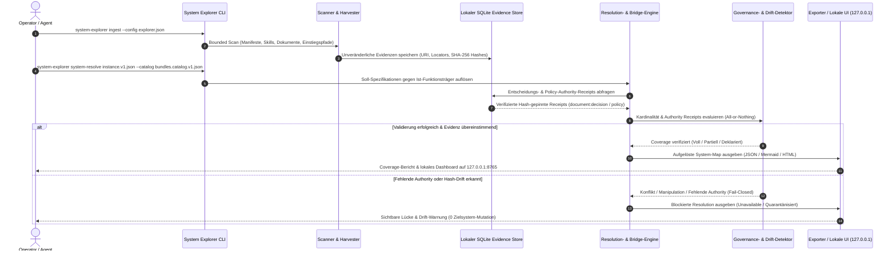

# system-explorer


[](https://github.com/ellmos-ai/system-explorer/actions/workflows/ci.yml)
[](tests)
[](pyproject.toml)
[](pyproject.toml)
[](SECURITY.md)
[](SECURITY.md)
[](LICENSE)
[](https://github.com/ellmos-ai)
[](https://github.com/open-bricks)
[](llms.txt)

[English](README.md) | [Deutsch](README_de.md)

> [!NOTE]
> Für einen LLM-optimierten Index und Schnellreferenz siehe [`llms.txt`](llms.txt).

`system-explorer` erstellt evidenzbasierte Landkarten eines modularen
Agenten- und Softwaresystems. Das Werkzeug trennt zwei Schichten:

1. **Soll-Funktionen** – was das Gesamtsystem bereitstellen soll.
2. **Funktionsträger** – Skills, Repositories/Module, MCP-Schnittstellen,
   Stacks, Akteure, Befehle oder sonstige Komponenten, die diese Funktionen
   tatsächlich oder voraussichtlich bereitstellen.

Diese Zuordnung macht volle, teilweise, fehlende, überlappende und negative
Coverage sichtbar. Eine Funktion ohne belegten Träger ist nicht bloß
„unbekannt“, sondern eine sichtbare Systemlücke.

## Schnellnavigation

- [Funktionen](#funktionen)
- [Evidenzbasierter Auflösungs-Lebenszyklus](#evidenzbasierter-auflösungs-lebenszyklus)
- [Schnellstart](#schnellstart)
- [Externe Composition- & Probe-Autoritäten](#externe-composition--und-probe-autoritäten)
- [Actual-Self Search Routing](#actual-self-search-routing)
- [Sicherheit & Wahrheitsschranken](#sicherheit-und-wahrheitsschranken)
- [Resolution als Soll-Evidenz](#resolution-als-soll-evidenz)
- [Explizite Funktions-Äquivalenz](#explizite-funktions-äquivalenz)
- [Bundles & Partner](#bundles-und-partner)
- [Sicherheitsrichtlinie](SECURITY.md)
- [LLM-Kontextindex](llms.txt)
- [Ökosystem & Geschwisterwerkzeuge](#ökosystem--geschwisterwerkzeuge)

## Funktionen

- Bounded Scanner für Manifeste, Skills, Einstiegspunkte und Dokumentenlinks
- Typisierte Steuerungskarten für `AGENTS.md`, `CLAUDE.md`, `README.md`,
  Policies, Decisions, frei konfigurierte Steuerdokumente und Entry-Verzeichnisse
- Registry-, Datenbank- und Cloudkarten mit Tabellen, Ist-/Soll-Datenakteuren,
  Transferwegen und reinen Credential-Referenzen
- Lokale SQLite-Evidenzregistry mit URI, Locator, Hash und zeitlichem Kontext
  statt kopierter Quelldaten
- Soll-Spezifikation für Funktionen, Träger, Coverage und Struktur
- Transcript-Adapter für Codex, Claude Code, Claude Desktop, Gemini/agy, Kimi
  und generisches JSONL
- Ein opt-in, standardmäßig deaktivierter Provider-Native Hook-Vertrag, der nur
  redigierte Call-/Result-/Error-Metadaten und Quell-Hashes speichert
- Ist-, Soll-, Diff- und Coverage-Karten als JSON, ASCII, Mermaid und HTML
- Föderierte Kartenimporte/-exporte mit geräteidentischen Sichten,
  Systemgrenzen und Gesamtsystemanalyse
- Private/halb-offene Server-Checks, Schutzbedarfsabdeckung,
  Kosten-/Lokalitätsvergleiche und Purpose-Checks für einzelne Module oder Repos
- LLM-Trace- und LLM-Action-Karten für Sessions und CLI-, API-, Tool- und
  Systemverbindungswege
- Funktionswegekarten von Einstiegspunkten und Akteuren über Träger bis zu
  Funktionen, Ausgaben und systemübergreifenden Handoffs
- Kristallisation peripherer Ressourcen für installierte Software, externe
  Module, Repositories, Skripte und Skills inklusive LLM-Steuerweg,
  Flexibilität und evidenzpflichtigem Token-Sparpotenzial
- Additive V4-Composition-Verträge für Bundles, Kataloge, Systeme,
  Soll-Instanzen, Resolution-Tests und Fleets
- Deterministische gepinnte Read-Only-Auflösung mit Profilen, Unterdrückungen,
  Root-Containment und kanonischen Inhalts-Hashes
- Flottenauflösung über Hosts: stabile Fleet-IDs getrennt von relativen
  Manifestpfaden, bewahrte Host-Bindungen, begründete Soll-Abweichungen und
  blockierende Lücken getrennt von tolerierten
- Typisierte Read-Only-Bridge von `system-explorer.resolution.v1` in Soll- und
  Coverage-Evidenzen mit Anforderungsschwere und Providerüberlappung
- Explizite gehashte Funktionsäquivalenzverträge zwischen abweichenden
  Soll- und Ist-Funktions-IDs ohne Namens- oder Ergebnisheuristik
- Optionale ApiProber-Evidenzaufnahme für autorisierte passive REST-Checks
- `ai-media-editor`-Konnektor für erklärvideotaugliche Storyboards,
  Sprechertexte und Mermaid-Visuals aus analysierten Systemkarten
- Sichere idempotente Repository-/Bundle-Diagrammpflege mit Dry-Run,
  Lock/Dirty-Gates, atomarem Readback und optionalem Commit und Push
- Lokale Weboberfläche mit evidenzbezogenen Detailansichten
- Rein lesende, promptgestützte Änderungsvorschläge mit Pflicht-Gates
- Pfad-Probing-Pläne für externe, budgetierte Schwarmtests

## Evidenzbasierter Auflösungs-Lebenszyklus

Das folgende Sequenzdiagramm veranschaulicht den Lebenszyklus von begrenzter Systementdeckung, Hash-gepinnter Authority-Receipt-Validierung, All-or-Nothing-Auflösung und Drift-Erkennung:



## Schnellstart

```powershell
python -m venv .venv
.\.venv\Scripts\python -m pip install -e .
system-explorer init --config explorer.json
system-explorer ingest --config explorer.json --time-budget-seconds 300
system-explorer coverage --config explorer.json
system-explorer assess --config explorer.json
system-explorer map --config explorer.json --view control --format mermaid
system-explorer map --config data-cloud.json --view data --format html --output data-map.html
system-explorer documents --config explorer.json --role policy
system-explorer register X:\system\SPECIAL-ENTRY.md --role control --entry --config explorer.json
system-explorer map --config explorer.json --view coverage --format html --output map.html
system-explorer map-export --config explorer.json --view all --output system-map-WORKSTATION.json
system-explorer map-import system-map-LAPTOP.json --config explorer.json
system-explorer map --config explorer.json --view llm-traces --system LAPTOP
system-explorer map --config explorer.json --view federation
system-explorer server-check --config deployment.json
system-explorer provider-refresh --config deployment.json
system-explorer purpose-check --target carrier:system-explorer --config deployment.json
system-explorer resources --config software-resources.json
system-explorer map --config software-resources.json --view resources
system-explorer explain-video --config explorer.json --output explainer-package --media-editor ..\ai-media-editor --probe
system-explorer diagrams --repo C:\_Local_DEV\repos\my-module
system-explorer diagrams --bundle .\bundles\media.bundle.v1.json --apply --commit --push
system-explorer manifest-validate C:\path\to\a-system-repo
system-explorer component-registry-check component.registry.bindings.v1.json --bundle-root bundles
system-explorer system-resolve instance.v1.json --catalog bundles.catalog.v1.json --registry-bindings component.registry.bindings.v1.json
system-explorer fleet-resolve fleet.v1.json --catalog bundles.catalog.v1.json
system-explorer coverage --config explorer.json --resolution resolved-system.json
system-explorer coverage --config explorer.json --equivalence function-equivalence.json
system-explorer import-resolution resolved-system.json --config explorer.json
system-explorer import-function-equivalence function-equivalence.json --config explorer.json
system-explorer test-resolve system-test.v1.json --catalog bundles.catalog.v1.json
system-explorer serve --config explorer.json
```

Standardmäßig bindet die Oberfläche ausschließlich an `127.0.0.1:8765`.

### Begrenzte Scans und Fortschritt

`scan` und die Scanphase von `ingest` haben ein standardmäßiges CLI-Zeitbudget
von 300 Sekunden. Jeder Root wird als eigener transaktionaler Checkpoint
abgearbeitet. Tritt vor dem Commit ein Fehler auf, wird die offene
Root-Transaktion zurückgerollt; bereits abgeschlossene Roots bleiben konsistent
gespeichert. Tritt ein Fehler exakt an einer nicht mehr offenen
Commit-Grenze auf, meldet die Telemetrie `root_commit_state_uncertain`, statt
fälschlich ein Rollback zu behaupten. Im JSONL-Modus werden Fortschritt und
CLI-Fehler ausschließlich als JSONL auf `stderr` geschrieben, während das
Endergebnis ausschließlich auf `stdout` landet.

```powershell
python -m system_explorer.cli scan `
  --config C:\path\to\system-explorer.json `
  --time-budget-seconds 900 `
  --progress jsonl `
  --progress-interval-seconds 5
```

`--progress off` schaltet die Telemetrie ab. `--time-budget-seconds 0`
deaktiviert die Frist explizit; für unbeaufsichtigte Läufe wird das nicht
empfohlen. `Strg+C` beendet mit Exit-Code 130 und rollt eine offene
Transaktion zurück. Ein Resume-Cursor existiert noch nicht: Der nächste Lauf
scannt die Roots erneut und nutzt idempotente Upserts. Ein harter
Prozessabbruch kann weiterhin SQLite-Recovery-Artefakte erzeugen und ist kein
kontrollierter Shutdown.

In einem zusätzlichen Git-Worktree kann ein global editable install noch auf
einen anderen Klon verweisen. Für einen belegbar korrekten Testlauf daher
entweder ein isoliertes venv im Worktree nutzen oder seine Source explizit
voranstellen:

```powershell
$env:PYTHONPATH = (Resolve-Path .\src).Path
python -m unittest discover -s tests -v
python -m ruff check src tests
```

Eigene Steuerdateien werden über `control_documents` (Glob, Rolle,
Entry-Flag), Einstiegsverzeichnisse über `entry_directories` konfiguriert. Die
Control- und Baumansichten zeigen aufgelöste und fehlende Pointer zusammen
mit ihrer Quellzeile. Weitere Dokumente lassen sich auch interaktiv über CLI
und lokale Weboberfläche registrieren und wiederfinden.

Die Data-Sicht erkennt JSON-Registries und SQLite-Schemata automatisch.
Weitere Registries, Datenbanken, Tabellenzwecke, Schreiber/Leser,
Cloud-Anbindungen, direkte oder indirekte Spiegel und Credential-Referenzen
werden neutral per Konfiguration beschrieben; siehe
[`examples/data-cloud.json`](examples/data-cloud.json). Credential-Werte
werden weder gelesen noch gespeichert.

Systemidentität wird unter `system` definiert; `map_imports`, `connections`
und `handoffs` bilden externe Karten, SSH/Tailscale-Verbindungen und
asynchrone `.SYNC`-Übergaben ab. Jede Domänenansicht kann in CLI und UI auf ein
Herkunftssystem eingeschränkt oder über alle verfügbaren Karten kombiniert
werden. Siehe [`docs/FEDERATED-MAPS.md`](docs/FEDERATED-MAPS.md) und
[`examples/deployment-federation.json`](examples/deployment-federation.json).

Server- und Repository-Zwecke werden als Kriterien statt als bloße Etiketten
bewertet. Regeln für private Server, halb-offene Dienste, ApiProber und
Kostenvergleiche stehen in
[`docs/DEPLOYMENT-PURPOSE-MODEL.md`](docs/DEPLOYMENT-PURPOSE-MODEL.md); eine
datierte Provider-Baseline liegt in
[`docs/CLOUD-SERVER-BASELINE_2026-07-29.md`](docs/CLOUD-SERVER-BASELINE_2026-07-29.md).

Installierte Software wird nicht automatisch mit LLM-Nutzbarkeit gleichgesetzt.
`software_resources` und eine begrenzte `software_discovery.commands`-Allowlist
registrieren Ressource, Funktion und Steuerweg. `◆`, `◇`, `△`, `○` und `?`
markieren native, direkte, indirekte, reine Referenz- und unbelegte
LLM-Bereitschaft. Die Regeln und Wahrheitsschranken stehen in
[`docs/CRYSTALLIZED-RESOURCES.md`](docs/CRYSTALLIZED-RESOURCES.md); eine
neutrale Konfiguration liegt in
[`examples/software-resources.json`](examples/software-resources.json).

Die V4-Verträge, Hashregeln, Output-/Log-Bindings und CLI-Grenzen stehen in
[`docs/V4-COMPOSITION-CONTRACTS.md`](docs/V4-COMPOSITION-CONTRACTS.md).
`manifest-validate` prüft wahlweise eine Datei oder einen ganzen Repo-Baum.
`component-registry-check` validiert typisierte Bundle-Refs gegen exakt
gehashte native Quellen und berechnet `declared_only`-Gates
vorkommensbezogen. `system-resolve --registry-bindings` konsumiert genau
diese kanonische Logik; ein zweiter Resolver im Manifest-Repository ist nicht
erforderlich. Hostbezug und Beobachtungszeit gehören nur in explizit erzeugte
Receipts, nicht in das hostneutrale Binding-Manifest.
Resolverausgaben werden nur bei explizitem `--output` atomar geschrieben;
Runtime-Aktionen und Zielsystemmutationen bleiben ausgeschlossen.

### Externe Composition- und Probe-Autoritäten

Kardinalitätsregeln werden ausschließlich über eine versionierte,
SHA-256-gepinnte externe Referenz konsumiert. Der Evaluator prüft `exact`,
`min` und `max` je Scope, Provider, Komponente und Funktion und trennt
absichtliche Überlappung, Doppelbelegung und echten Konflikt. Fehlende,
abgelaufene oder widersprüchliche Regeln blockieren das Proposal-Gate; eine
zweite lokale Regelautorität wird nicht erzeugt.

Externe Schwarmresultate lassen sich als referenzielle Probe-Receipts importieren:

```powershell
system-explorer import-probe-receipt probe-receipt.json --config explorer.json `
  --source-sha256 <autorisierter-source-sha256> --runner-id runner-1 --task-id task-1
```

Der Import prüft Provenienz, Identitäten, Source-/Content-Hash und Idempotenz
und speichert nur Evidenz-Metadaten und einen Index. Ein Receipt allein beweist
weder Function Coverage noch Actual-Self-Identität oder Autorisierung.

Für ein gepinntes externes `ellmos.stack.v2`-Schema wird
`--stack-schema-pin stack-schema-pin.json` an `system-resolve` übergeben. Eine
fehlende, abgelaufene, hashabweichende oder inkompatible Quelle blockiert die
Auflösung; das externe Schema wird vor Ort geprüft und nicht kopiert.

Der Standard bleibt fail-closed, wenn eine erforderliche Komponente nur
deklariert ist. Für das Vollinventar eines Entwicklungssystems, das bewusst
geplante und inaktive Bundles enthält, kann
`--emit-blocked-resolution` eine source-verifizierte Resolution für
rein lesende Identitäts- und Evidenzprüfungen ausgeben. Jedes betroffene
Bundle bleibt `blocked`; alle seine Komponenten und Funktionen werden als
`unavailable` operativ quarantänisiert, während ihr deklarierter Zustand als
Evidenzmetadatum erhalten bleibt. Die Ausgabe wird als
`blocked-evidence-only` markiert; der Schalter erteilt weder eine
Runtime-Aktivierung noch einen ausführbaren Provider.

### Actual-self Search Routing

`import-actual-self` nimmt eine gehashte und Ed25519-signierte
`ellmos.actual-self-component-receipt.v1` aus einer nativen
Laufzeitabfrage auf. Stable Ref, Registry-Hash, Source-/Record-ID,
Hostscope, Ablaufzeit und exakte Funktions-IDs müssen mit einer bereits
source-verifizierten Resolution übereinstimmen. Der Producer – zum Beispiel
`access_surface:controlcenter` – bleibt Evidenzursprung und wird nicht zum
Funktionsprovider umgedeutet. `declared`, `inferred`, fremde Hosts,
abgelaufene Receipts und Namensähnlichkeit liefern keine Verfügbarkeit.
Erlaubte Signer, Hosts, Adapter, Receipt-Schemata und Maximal-TTL stammen
aus dem lokalen content-gehashten
`system-explorer.receipt-trust-store.v1`; die Abfrage kann keinen eigenen
Trust-Key mitgeben. Zusätzlich muss `receipt_trust_store_sha256` in der
lokalen Explorer-Konfiguration den SHA-256 der Trust-Store-Datei getrennt
pinnen; der im Store hinterlegte Content-Hash ist kein Trust-Root. Jeder
Signer-Datensatz pinnt zusätzlich den SHA-256 der referenzierten
Public-Key-Datei. Dieser Schlüssel-Pin wird bei jeder Verifikation erneut
geprüft, sodass eine ausgetauschte PEM-Datei nicht durch einen
unveränderten Trust-Store autorisiert werden kann.

```powershell
system-explorer search-route search-query.json `
  --config explorer.json `
  --resolution resolved-system.json `
  --actual-self controlcenter-native-readback.json `
  --authority-receipt scoped-decision-receipt.json `
  --output search-receipt.json
```

`search-route` akzeptiert keine Freitextsuche. Exakte Treffer, semantisches
Ranking und ControlCenter-Lexikalsuche dürfen nur typisierte Stable-Refs
liefern. System Explorer filtert diese anschließend gegen
Registry-Identität, Actual-Self-Evidenz und scopespezifische Coverage.
Scores werden ausschließlich innerhalb ihrer explizit benannten
`score_domain` verglichen. Mehrdeutigkeit bleibt fail-closed.

Die erzeugte `ellmos.search-routing-receipt.v1` ist standardmäßig
read-only und führt kein Tool aus. Eine explizit angeforderte ausführbare
Auswahl erfordert zusätzlich passende, separat signierte
`ellmos.search-authority-receipt.v1`-Referenzen. Die Abfrage enthält nur deren
Stable-Refs; eingebettete oder selbst-behauptete Authority-Felder sind
ungültig. Eine `delegated-avatar-decision` gilt nur innerhalb ihrer
Komponenten-, Capability-, Query-, Host- und Systemscopes und erfordert
Delegationsreferenz, Evidenzreferenzen, Mindestvertrauen, Frische und
Freiheit von Konflikten. Die Policy des Signers muss die Delegationsreferenz
explizit erlauben. Signer-Aussteller und `scope.host_ids` müssen zum Host
der aktuell aufgelösten Systeminstanz passen; ein Multi-Host-Signer erlaubt
kein Replay auf fremden Hosts. Eine reine TOM_lm-Vorhersage ist keine
Authority. Gespeicherte Actual-/Authority-Receipts werden bei jeder Suche
erneut kryptographisch verifiziert; ein manipulierter SQLite-Metadatensatz
genügt nicht. Jede Authority-`evidence`- und -`conflicts`-Referenz muss
sich zudem eindeutig im lokalen Evidence Store mit exakt deklariertem
SHA-256 und autorisierendem Quelltyp `document:decision` oder
`document:policy` auflösen lassen. Externe oder read-only Belege, fehlende,
gelöschte, mehrdeutige oder hashabweichende Einträge blockieren ausführbare
Authority.

Der `ai-media-editor`-Konnektor materialisiert einen UC6-Handoff mit
Storyboard, deutschem Sprechertext und Mermaid-Visuals aus ausgewählten
Karten. Er rendert Medien nicht stillschweigend selbst und kopiert keine
Roh-Evidenzen. Der separate Repository-Diagrammadapter schreibt nur eine
markierte generierte Dokumentationsdatei in explizit benannte Git-Roots;
Dry-Run ist Standard. Vertrag und Sicherheitsgates stehen in
[`docs/CONNECTOR-ADAPTERS.md`](docs/CONNECTOR-ADAPTERS.md).

## Sicherheit und Wahrheitsschranken

- Quellen verbleiben am Ort; es werden nur Referenzen und Prüfsummen gespeichert.
- Prompt- und Transkriptinhalte werden nicht gespeichert.
- Eine Manifest-Deklaration belegt keine tatsächliche Nutzung.
- Ein Toolaufruf belegt erfolgreiche Funktionsausführung nur zusammen mit
  Ergebnis, Readback oder Test.
- Das Modul erzeugt Vorschläge, verändert aber keine Zielsysteme.
- Neuere Evidenz gewinnt nur innerhalb derselben Relation; ältere positive
  Evidenz kann negative Evidenz nicht überdecken.

Details stehen in [ARCHITECTURE.md](ARCHITECTURE.md), Datenregeln in
[`docs/EVIDENCE-MODEL.md`](docs/EVIDENCE-MODEL.md) und Adaptergrenzen in
[`docs/PROVIDER-ADAPTERS.md`](docs/PROVIDER-ADAPTERS.md).

## Resolution als Soll-Evidenz

Eine gespeicherte `system-explorer.resolution.v1`-Ausgabe kann direkt als
Soll-Evidenz importiert werden:

`ellmos.system.v1` darf gepinnte `subsystem_refs` komponieren. Der Resolver
validiert deren Rolle und Profil, weist Pfad-/Identitätszyklen ab und behält
jedes Kind als unabhängig gehashte verschachtelte Resolution; Kind-Bundles
und -Funktionen werden niemals in das Elternsystem abgeflacht. Identische
System-/Instanzausgabe-Bindungen werden dedupliziert, während
widersprüchliche Policies für dasselbe Ziel fail-closed abgewiesen werden.
Solange keine bereichsspezifische Subsystemprojektion existiert, weist der
Resolution-Importer einen nicht-leeren Subsystembaum explizit ab, statt ihn
stillschweigend zu verwerfen.

Benötigt ein Aufrufer Evidenzen für eine Komponente im Wurzelsystem, bevor
eine Kindprojektion verfügbar ist, dient `--root-only-resolution` als
expliziter Bereichs-Fallback für `import-resolution`, `import-actual-self`,
`import-search-authority` und `search-route`. Er importiert nur
Wurzel-Träger, vermerkt `projection_scope: root-only` sowie die exakte Anzahl
ausgelassener Subsysteme und behandelt Kinder niemals als abwesend oder
verifiziert.

```powershell
system-explorer coverage `
  --config explorer.json `
  --resolution resolved-system.json
```

Alternativ nimmt `desired_resolution_sources` in der Explorer-Konfiguration
einen oder mehrere Resolution-Pfade auf; `coverage` und `ingest` importieren
diese relativ zum Konfigurationsverzeichnis. Scope und `component.ref`
bestimmen eine kollisionssichere gehashte Carrier-ID; beide Klartextwerte
bleiben in den Metadaten erhalten. Nur bekannte aktive `desired_status`-Werte
und deren `provides` erzeugen Soll-Funktionskanten; `unavailable` bleibt als
Carrier-Status sichtbar, liefert aber keine Funktion. `consumes` bleibt
beschreibendes Carrier-Metadatum. `required`, `recommended`, `optional` und
`desired_status` bleiben an den Kanten erhalten. Eine neuere Resolution
derselben Instanz ersetzt ihre ältere aktive Soll-Projektion. Ältere
Generationen werden bei späteren Importen als `stale-ignored` protokolliert
und können den aktiven Zustand nicht zurückrollen; gleiche Generationen mit
abweichendem Content-Hash werden als Konflikt abgewiesen. Parsing,
Source-Hash und Dateimetadaten stammen aus demselben geöffneten
Byte-Snapshot. Statusvalidierung und Projektionsersetzung laufen gemeinsam
innerhalb einer SQLite-`BEGIN IMMEDIATE`-Grenze, sodass parallele Importe
desselben Scopes seriell entschieden werden.

Die Coverage-Ausgabe trennt `discovery_summary` von `desired_summary` und
berichtet mehrere Resolution-Scopes einzeln: Nur `required` zählt als harte
Lücke, während empfohlene und optionale Lücken getrennt sichtbar bleiben.
Mehrere Soll-Provider innerhalb desselben Scopes erscheinen als
`desired_overlap`; dieselben Provider auf unterschiedlichen Hosts werden
nicht zu einem künstlichen Overlap verschmolzen. `assess` und `propose`
wahren diese Scope-Grenze, sodass ein erfüllter Host die Lücke eines anderen
Hosts nicht verdecken kann. Ist-Coverage erfordert zusätzlich einen
typisierten Match von `component_ref` oder `stable_ref`. Ein abweichend
beobachteter Provider auf demselben Host wird als `wrong-provider` und
`carrier-mismatch` ausgewiesen, nicht als Erfüllung der Soll-Funktion. Ein
Fallback, den die Resolution explizit als zweiten Provider ausweist, bleibt
coverage-fähig. Bei hostgebundenen Instanzen zählt nur die explizite
Host-ID; weder der Instanz-Scope noch eine gemeinsame logische System-ID
dürfen mehrere Hosts zugleich bedienen.

Der Scanner propagiert echte Komponentenidentität ohne Namensheuristiken:
Gültige `ellmos.module.v2`-Manifeste liefern exakt `module:<id>`, Skills nur
eine explizit deklarierte `component_ref`. Doppelte Quellbehauptungen sind ein
Fail-Closed-Konflikt; ungetaggte Träger und bloße Namens-, Schreibweisen-,
Pfad-, Tag-, Paket- oder Befehlsähnlichkeit bleiben von Coverage
ausgeschlossen. Softwareressourcen werden nur gebunden, wenn ihre kanonische
Konfigurationsdeklaration ebenfalls als gehashte Evidenz vorliegt.

Der Import schreibt ausschließlich in die lokale Explorer-Evidenzregistry.
Resolutionen mit nicht-leeren `runtime_actions` oder `target_mutations`
werden abgewiesen; weder Quell- noch Zielsystem werden verändert.

## Explizite Funktions-Äquivalenz

Abweichende Soll- und Ist-Funktions-IDs werden niemals über Namen,
Groß-/Kleinschreibung, Pfade, Tags oder ein ähnlich beschriebenes Ergebnis
gleichgesetzt. Eine positive Zuordnung erfordert stattdessen einen
`system-explorer.function-equivalence.v1`-Vertrag mit:

- typisierter `component_ref`;
- exakten Schema-, Versions- und Content-Hash-Pins für Soll- und Ist-Vertrag;
- typisierter Decision- oder Policy-Authority;
- im Evidence Store bereits vorhandener Decision-/Policy-Evidenz mit
  identischer URI und SHA-256 sowie demselben konkreten `authority_ref`;
- verifiziertem Ist-Träger auf exakt demselben Host;
- positiver nativer Ist-Evidenz mit zulässigem Readback-/Probe-Quelltyp und
  SHA-256. `declared` und `inferred` genügen nicht.

Template-Verträge sind hostneutral; tatsächliche Host-Abweichungen erfordern
einen expliziten `host-override` mit Host-ID und Begründung. Mehrere
zutreffende Authorities für dasselbe Ziel sind ein Konflikt und materialisieren
keine Coverage. Vertrags- oder Scanner-Hashdrift entzieht die Coverage bis zum
erneuten Vorliegen eines Mappings. Die synthetische Kante erbt den nativen
Ist-Status und kann ihn nicht aufwerten; `observed` bleibt daher partielle
Coverage.

Das V4-Inventar ergab 68 eindeutige Soll-Funktions-IDs und 886
Ist-Funktions-IDs ohne exakte Schnittmenge. Dieses Release stellt daher bewusst
nur Registry, Importer und synthetische Tests bereit, aber kein reales
Äquivalenz-Mapping. Reale Paare werden erst nach explizitem
Capability-Vertrag und Decision-/Policy-Provenienz ergänzt.

## Bundles und Partner

`system-explorer` bleibt für sich allein nutzbar. In einer V4-Komposition ist
es der erforderliche Discovery-, Mapping- und Coverage-Prüfer für das
`ellmos-core-discovery-bundle`. Direkte Partner sind `ellmos-core` als
Orchestrierungsaufrufer sowie als empfohlener Komponenten-Resolver und
Semantic-Routing-Partner.

Das Modul kann zudem an zwei Grenzen lesend unterstützen:

- `ellmos-governance-assurance-bundle`: optionales Mapping von
  Entscheidungsdokumenten, Policies und Referenzen. Entscheidungen und
  Policies verbleiben bei ihren Domänenautoritäten.
- `ellmos-sync-federation-bundle`: empfohlene cloud-sichere Kartenprojektion.
  Föderation und Transfer verbleiben bei ihren designierten Trägern.

MCP-Server wie ControlCenter sind Zugangsflächen, keine Funktionseigentümer
dieses Moduls. Verbindliche Zugehörigkeiten, Versionen, Profile und private
Kompositionsrezepte stehen ausschließlich im jeweiligen Bundle-Manifest; diese
öffentliche Übersicht ist nur ein sicherer Einstiegshelfer.

## Ökosystem & Geschwisterwerkzeuge

`system-explorer` ist Teil des [`ellmos-ai`](https://github.com/ellmos-ai)-Ökosystems unter dem Dach von [`open-bricks`](https://github.com/open-bricks):

| Werkzeug | Schwerpunkt & Zweck |
|----------|---------------------|
| [`policy-registry`](https://github.com/ellmos-ai/policy-registry) | Kanonische Policy-Verwaltung & Evaluationsverträge |
| [`sqlite-transit-sync`](https://github.com/ellmos-ai/sqlite-transit-sync) | SQLite-Replikation & Delta-Synchronisationsbrücke |
| [`coma`](https://github.com/ellmos-ai/coma) | Kontextmanager & semantischer Router für LLM-Agenten |
| [`automation-master`](https://github.com/ellmos-ai/automation-master) | Enterprise Automatisierungs-Orchestrierung & Scheduling |
| [`ellmos-delegation-authority`](https://github.com/ellmos-ai/ellmos-delegation-authority) | Fail-Closed signierte Delegations- & Beweissicherungs-Autorität |
| [`ellmos-controlcenter-mcp`](https://github.com/ellmos-ai/ellmos-controlcenter-mcp) | Zentraler MCP-Steuerungs-Hub für Tools, Profile & Entscheidungen |
| [`ellmos-filecommander-mcp`](https://github.com/ellmos-ai/ellmos-filecommander-mcp) | Hochperformanter Dateisystem-Manipulations-MCP-Server |
| [`ellmos-codecommander-mcp`](https://github.com/ellmos-ai/ellmos-codecommander-mcp) | Code-Intelligenz, AST-Refactoring & Struktur-Edit-MCP-Server |
| [`n8n-manager-mcp`](https://github.com/ellmos-ai/n8n-manager-mcp) | Visuelle Workflow-Automation & Node-Konfigurations-MCP-Server |
| [`lock-master`](https://github.com/ellmos-ai/lock-master) | Prozessübergreifendes atomares Lock-Management & Ressourcen-Leasing |
| [`ticket-master`](https://github.com/ellmos-ai/ticket-master) | Deterministisches Aufgaben-Tracking & atomares Ticket-Ledger |
| [`clutch`](https://github.com/ellmos-ai/clutch) | Transaktionales Git-Zustandsmanagement & atomare Branch-Operationen |
| [`DevCenter`](https://github.com/dev-bricks/DevCenter) | Entwickler-Arbeitsplatz-Hub & Werkzeug-Registry |
| [`CodeBox`](https://github.com/dev-bricks/CodeBox) | Isolierte Code-Ausführung & Test-Harness |
| [`MethodenAnalyser`](https://github.com/dev-bricks/MethodenAnalyser) | Code-Komplexitäts- & Methoden-Struktur-Analyse |
| [`CleanMarkdown`](https://github.com/doc-bricks/CleanMarkdown) | Deterministische Markdown-Formatierungs- & Linting-Engine |
| [`PDFtoPDFocr`](https://github.com/doc-bricks/PDFtoPDFocr) | Local-First durchsuchbare PDF-OCR & Textextraktion |
| [`open-bricks`](https://github.com/open-bricks) | Dachorganisation für souveräne Desktop- & Entwickler-Werkzeuge |
