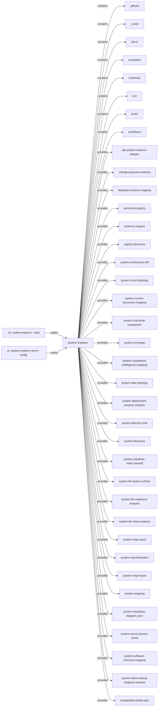

# System map: System Explorer

<!-- generated-by: system-explorer -->
<!-- source-fingerprint: c581c2cfd65d66e9d3c4518966b39fa0612116583d699130e46acb796931bce6 -->

Diese Datei wird deterministisch aus dem Repository- bzw. Bundle-Vertrag
erzeugt. Änderungen erfolgen über `system-explorer diagrams`.

